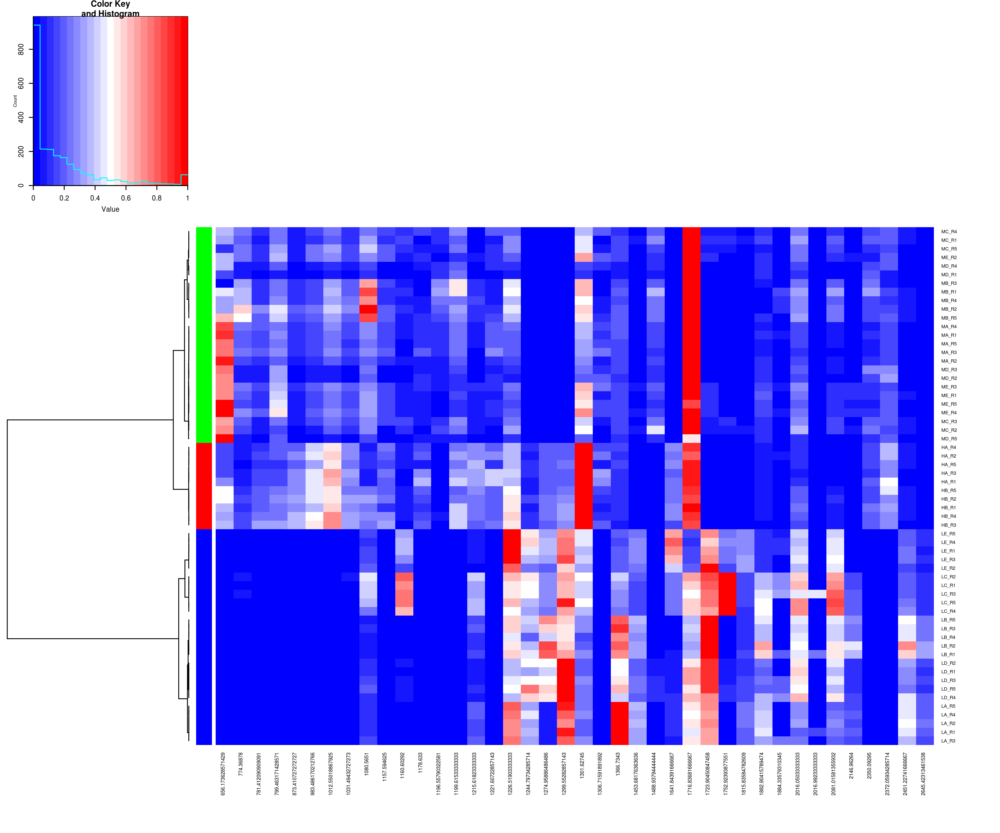
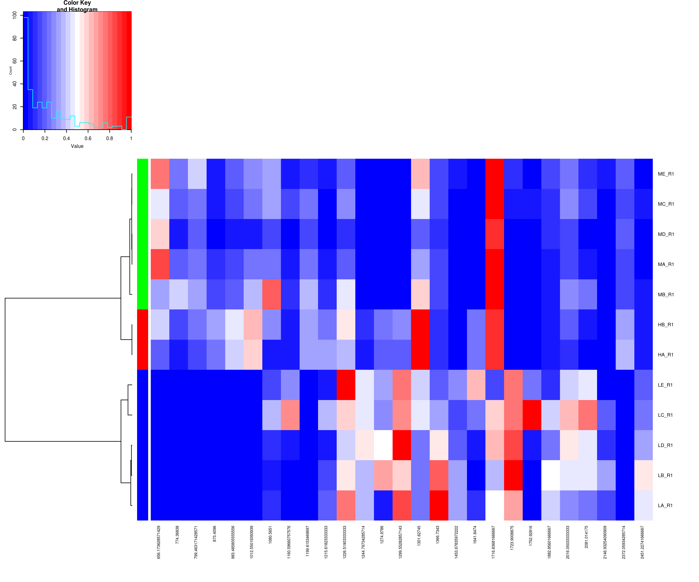

# `clustering`
This example creates a clustering of the samples cancer dataset and displays the results using a heatmap along with a dendrogram.

It uses the `getBinnedPeaksMatrix` function to align the dataset and create an intensity matrix using MALDIquant functions. The `peakIntensityThreshold` is used to filter out peaks that do not have reach this threshold in all samples.

Samples` dendrogram is created using correlation-based distances and the Ward method of hierarical clustering. I have followed some recommendations given by Melissa Key in [this paper](http://dx.doi.org/10.1186%2F1471-2105-13-S16-S10) entitled *A tutorial in displaying mass spectrometry-based proteomic data using heat maps* and published in *BMC Bioinformatics, 13(Suppl 16), S10*.

Previous example uses the complete cancer dataset with five replicates per sample. By loading it with `data <- cancerDataset(consensus=TRUE)`, a consensus spectrum is created from the replicates of each sample. This way, clustering will have as many rows as samples in the dataset.

