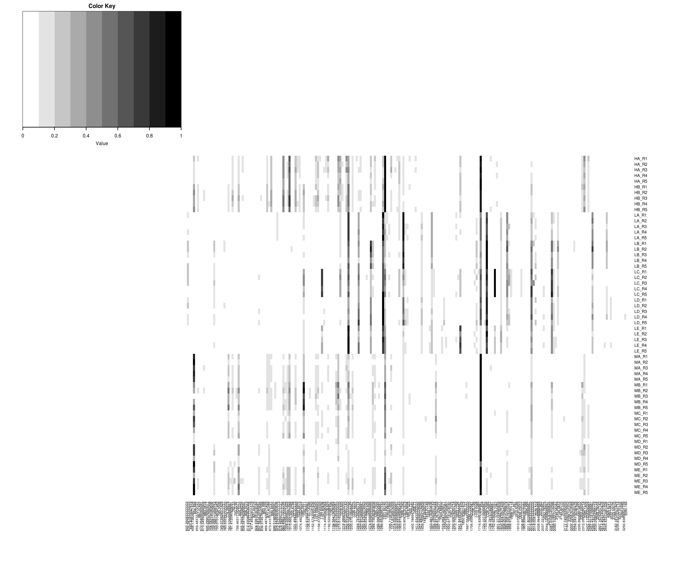

# `explore-data`
This example creates a grayscale heatmap to visually inspect the cancer dataset. 

It uses the `getBinnedPeaksMatrix` function to align the dataset and create an intensity matrix using MALDIquant functions. The `peakIntensityThreshold` is used to filter out peaks that do not have reach this threshold in all samples.

I have followed some guidelines found in [this tutorial](http://sebastianraschka.com/Articles/heatmaps_in_r.html) to create the heatmap.