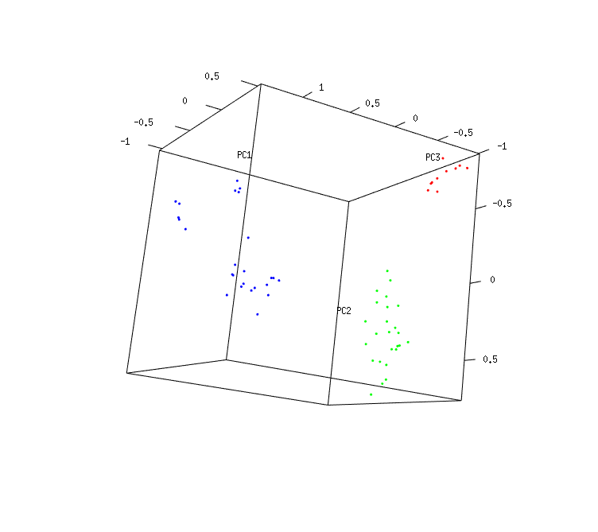

# `pca`
This example computes the principal components of the cancer dataset and uses the first three to create a 3D representation.

It uses the `getBinnedPeaksMatrix` function to align the dataset and create an intensity matrix using MALDIquant functions. The `peakIntensityThreshold` is used to filter out peaks that do not have reach this threshold in all samples. The, principal components are computed using `prcomp` function and first three are plotted using `plot3d` function from `rgl` package.

Within this library, snapshots can be created by using `rgl.snapshot("examples/pca/example.png)` function.